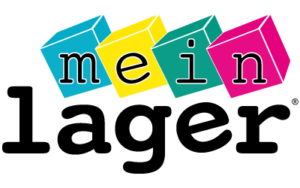

# Mein Lager Website

Welcome to the **Mein Lager** website repository. This website represents our company, **Mein Lager**, providing detailed information about our services, contact details, and more.

## Table of Contents

- [About Mein Lager](#about-mein-lager)
- [Features](#features)
- [Technologies Used](#technologies-used)
- [Setup and Deployment](#setup-and-deployment)
- [Usage](#usage)
- [Contributing](#contributing)
- [License](#license)
- [Copyright](#copyright)

---

## About Mein Lager

**Mein Lager** specializes in secure storage solutions tailored to individual and business needs.  
Our mission is to provide seamless and efficient storage services to our customers.

Visit the live site: [Mein Lager](https://ferrannl.github.io/meinlager/index.html)

---

## Features

- **Responsive Design**: Optimized for viewing on all devices, including mobile, tablet, and desktop.
- **Intuitive Navigation**: Easy-to-use interface for quick access to company information and services.
- **Service Overview**: Detailed descriptions of what Mein Lager offers.
- **Contact Section**: A straightforward way for users to get in touch with the company.

---

## Technologies Used

The website was built using the following technologies:

- **HTML5**: For semantic and structured content.
- **CSS3**: For styling and responsive design.
- **JavaScript**: For interactive elements.

---

## Setup and Deployment

### Prerequisites
- A modern web browser (e.g., Chrome, Firefox).
- (If hosting the project) A web server capable of serving static files or your chosen backend.

### Steps to Run Locally
Clone the repository:

# Copyright

© 2024 Mein Lager. All rights reserved.

Unauthorized copying, distribution, or modification of this content is prohibited without prior written permission from Mein Lager.

This website and its contents, including but not limited to text, graphics, logos, and designs, are the intellectual property of Mein Lager and are protected by copyright law. Use of any part of this website without explicit permission may result in legal action.

Visit our website: [Mein Lager](https://meinlager.org/)

For inquiries, please contact us at:  
**Email**: [info@meinlager.org](mailto:info@meinlager.org)  
**Phone**: 069 95418900
